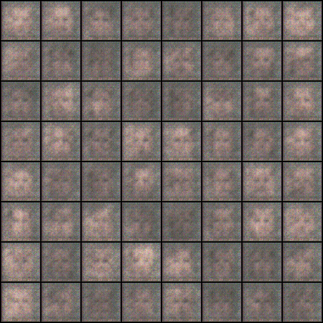
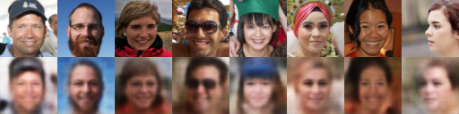
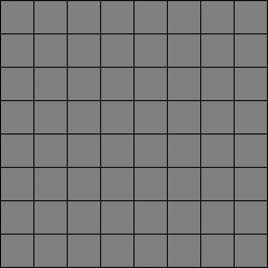
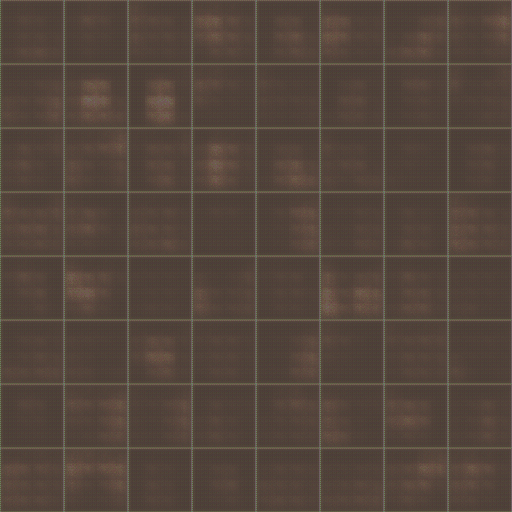
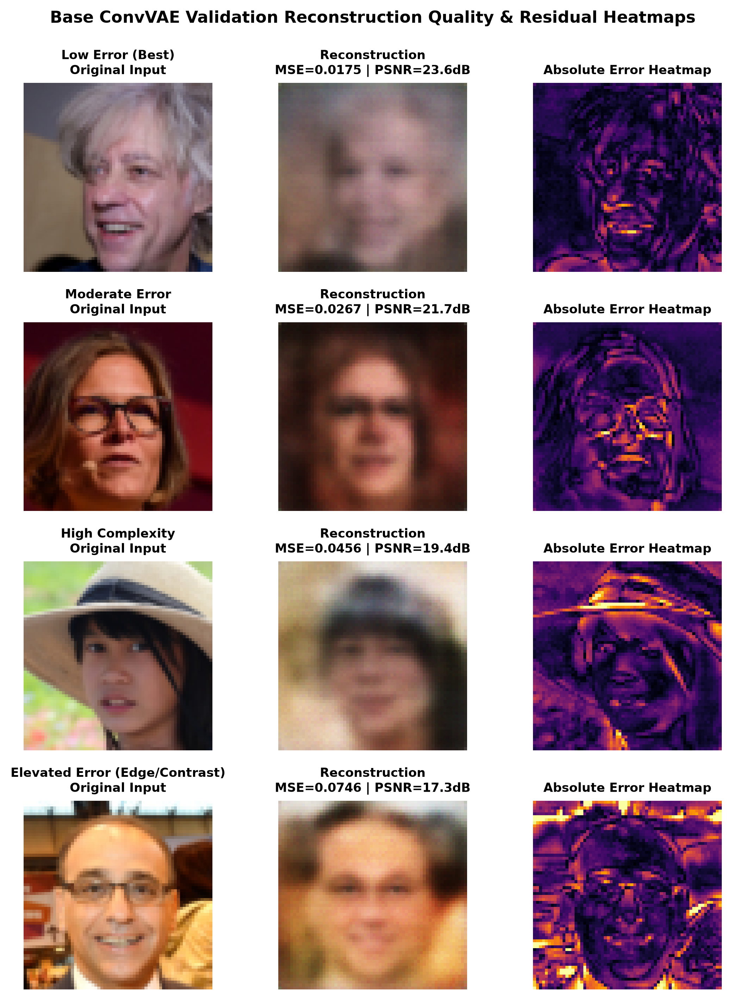
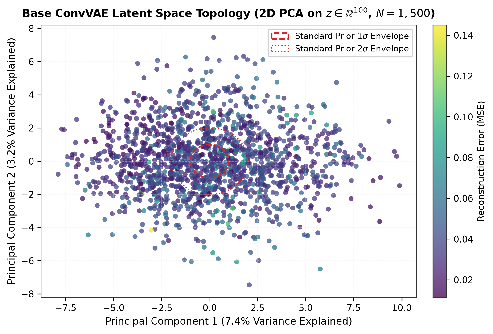
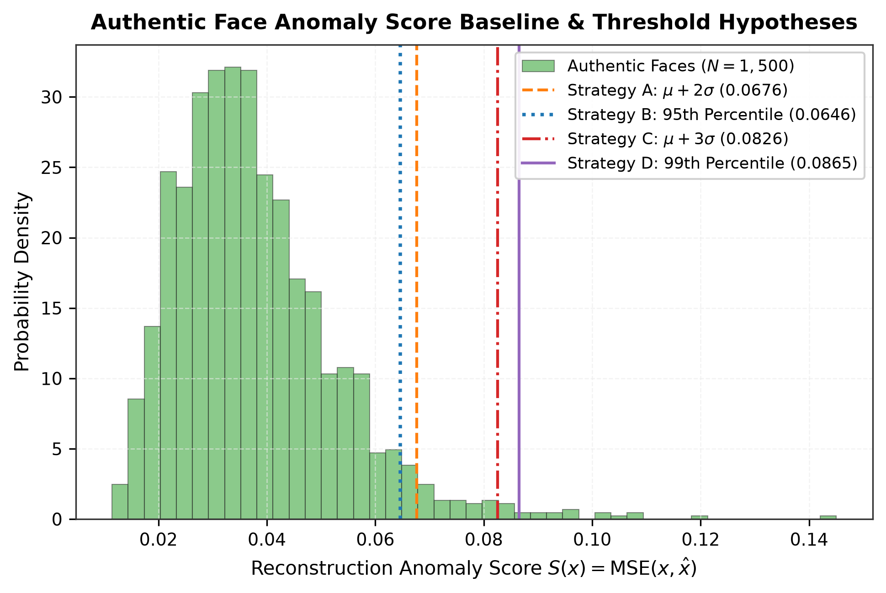

# SpectraVAE-GAN: Dual Generative Modeling on RVF10K

<div align="center">

[](https://pytorch.org/)
[](https://developer.nvidia.com/cuda-zone)
[](https://www.python.org/)
[](data/README.md)
[](LICENSE.txt)
[](#empirical-benchmarks--telemetry)

**First-Principles Generative Deep Learning on Human Face Synthesis & Anomaly Detection**  
*A rigorous comparative study of Convolutional Variational Autoencoders (ConvVAE) vs. Deep Convolutional GANs (DCGAN) built strictly from scratch.*

</div>

---

## 🌟 Visual Showcase

<div align="center">

| **1. Ground Truth Real Faces (RVF10K)** | **2. DCGAN 40-Epoch Synthesis (Ours)** | **3. ConvVAE Reconstruction (Ours)** |
|:---:|:---:|:---:|
|  |  |  |
| *Original $64 \times 64$ authentic face dataset* | *Sharp synthesized facial structures ($\text{FID}=58.92$)* | *Continuous manifold preservation ($\text{PSNR}=20.56\text{ dB}$)* |

</div>

<div align="center">

### Dynamic Training Progress Over Epochs

| **DCGAN Generative Evolution (40 Epochs)** | **ConvVAE Reconstruction Evolution (25 Epochs)** |
|:---:|:---:|
|  |  |
| *Adversarial dynamics transitioning from noise to coherent facial portraits* | *Monotonic convergence preserving identity and lighting geometry* |

</div>

---

## 📖 Table of Contents

- [1. Executive Summary & Core Mission](#1-executive-summary--core-mission)
- [2. Strict Pedagogical Constraints](#2-strict-pedagogical-constraints)
- [3. The Benchmark Dataset (RVF10K)](#3-the-benchmark-dataset-rvf10k)
- [4. Model Architectures & Mathematical Formulations](#4-model-architectures--mathematical-formulations)
  - [4.1 Base Convolutional Variational Autoencoder (ConvVAE)](#41-base-convolutional-variational-autoencoder-convvae)
  - [4.2 Deep Convolutional GAN (DCGAN) & Stabilization Framework](#42-deep-convolutional-gan-dcgan--stabilization-framework)
- [5. Visual Galleries & Evolution Reports](#5-visual-galleries--evolution-reports)
  - [5.1 DCGAN Adversarial Synthesis & Convergence](#51-dcgan-adversarial-synthesis--convergence)
  - [5.2 ConvVAE Reconstruction, Latent Space & Anomaly Detection](#52-convvae-reconstruction-latent-space--anomaly-detection)
- [6. Empirical Benchmarks & Telemetry](#6-empirical-benchmarks--telemetry)
- [7. In-Depth Paradigm Comparison: VAE vs. DCGAN](#7-in-depth-paradigm-comparison-vae-vs-dcgan)
- [8. Repository Structure](#8-repository-structure)
- [9. Quickstart & Reproducibility Guide](#9-quickstart--reproducibility-guide)
- [10. Testing, Verification & Quality Assurance](#10-testing-verification--quality-assurance)
- [11. Authors & Academic Context](#11-authors--academic-context)

---

## 1. Executive Summary & Core Mission

This repository implements, trains, evaluates, and compares two foundational paradigms of generative deep learning from **first mathematical principles**:

1. **Explicit Density Modeling:** A **Base Convolutional Variational Autoencoder (ConvVAE)** optimizing the Evidence Lower Bound (ELBO) for continuous representation learning, identity-preserving image reconstruction, and statistical anomaly detection.
2. **Implicit Adversarial Modeling:** A **Deep Convolutional Generative Adversarial Network (DCGAN)** trained in a two-player minimax game, reinforced with modern stabilization techniques (**TTUR, Spectral Normalization, EMA, One-Sided Label Smoothing**) to overcome mode collapse and synthesize sharp face portraits.

Both architectures were trained from scratch on the **RVF10K (Real vs. Fake 10,000 Faces)** dataset downsampled to $64 \times 64 \times 3$ RGB resolution.

---

## 2. Strict Pedagogical Constraints

To ensure pure algorithmic understanding and academic integrity, this project strictly adheres to first-principles rules:

- ❌ **Zero Pretrained Weights:** No ImageNet, torchvision, or Foundation Model checkpoints.
- ❌ **Zero Third-Party Generative Pipelines:** No Stable Diffusion, Midjourney, or CivitAI models.
- ❌ **Zero External Framework Wrappers:** No Hugging Face `diffusers` or black-box high-level APIs.
- ✅ **100% From-Scratch PyTorch:** All encoders, decoders, generators, discriminators, custom loss functions, and evaluation metrics are written explicitly in native PyTorch.

---

## 3. The Benchmark Dataset (RVF10K)

The project utilizes the **RVF10K** benchmark, consisting of 10,000 high-quality facial portrait photographs partitioned into real human portraits (FFHQ) and synthetic AI-generated portraits (StyleGAN).

<div align="center">
  
</div>

### Data Engineering & Anti-Leakage Isolation
- **Generative Training Isolation:** The generative training loops for both VAE and DCGAN are trained **strictly on authentic real faces** ($N_{\text{train}} = 3,500$ real images, $N_{\text{val}} = 1,500$ real images). Fake faces are quarantined and never seen during training to prevent circular bias.
- **Dynamic Range Normalization:** Images are normalized to $[-1.0, 1.0]$ via `transforms.Normalize((0.5, 0.5, 0.5), (0.5, 0.5, 0.5))` to match the `Tanh` activation function of the Decoders/Generators.
- **Batch Normalization Safeguards:** DataLoader configured with `drop_last=True` to guarantee constant mini-batch statistics ($B=64$) and eliminate destructive running mean/variance spikes.

<div align="center">

| **Authentic Real Faces** | **Synthetic DeepFake Artifacts** |
|:---:|:---:|
|  |  |

</div>

---

## 4. Model Architectures & Mathematical Formulations

```
                 ┌─────────────────────────────────────────────────────────┐
                 │                 DUAL GENERATIVE PARADIGMS               │
                 └────────────────────────────┬────────────────────────────┘
                                              │
                    ┌─────────────────────────┴─────────────────────────┐
                    ▼                                                   ▼
       ┌────────────────────────┐                          ┌────────────────────────┐
       │     Base ConvVAE       │                          │      Base DCGAN        │
       │ (Explicit Density /    │                          │ (Implicit Game /       │
       │  Reconstruction Focus) │                          │  Adversarial Focus)    │
       └────────────┬───────────┘                          └────────────┬───────────┘
                    │                                                   │
     x ──► [Encoder] ──► (μ, log σ²)                     z ~ N(0, I) ──► [Generator] ──► x_fake
                 │                                                                          │
          z = μ + σ ⊙ ε                                                                     ▼
                 │                                                           [Discriminator] ──► Score
                 ▼                                                                  ▲
     x_recon ◄── [Decoder]                                              x_real ─────┘
```

---

### 4.1 Base Convolutional Variational Autoencoder (ConvVAE)

The VAE maps high-dimensional input $x \in [-1, 1]^{3 \times 64 \times 64}$ to an isotropic Gaussian latent space $z \in \mathbb{R}^{100}$ using variational inference.

#### 1. Mathematical Objective (Negative ELBO):
$$\mathcal{L}_{\text{total}}(\theta, \phi; x) = \mathcal{L}_{\text{recon}}(x, \hat{x}) + \beta \cdot \mathcal{D}_{\text{KL}}\left( q_\phi(z \mid x) \,\parallel\, p(z) \right)$$

* **Reconstruction Loss (MSE):**
  $$\mathcal{L}_{\text{recon}}(x, \hat{x}) = \frac{1}{C \cdot H \cdot W} \sum_{c=1}^3 \sum_{h=1}^{64} \sum_{w=1}^{64} (x_{c,h,w} - \hat{x}_{c,h,w})^2$$
* **Analytic KL Divergence:**
  $$\mathcal{D}_{\text{KL}}\left(\mathcal{N}(\mu, \operatorname{diag}(\sigma^2)) \,\parallel\, \mathcal{N}(0, I)\right) = -\frac{1}{2} \sum_{j=1}^{100} \left( 1 + \log(\sigma_j^2) - \mu_j^2 - \sigma_j^2 \right)$$
* **Feature-Dimension Loss Normalization:**
  $$\beta = \frac{1}{D} = \frac{1}{3 \times 64 \times 64} = \frac{1}{12,288} \approx 8.138 \times 10^{-5}$$
  This crucial scaling balances pixel-wise MSE gradient magnitudes with the KL regularizer, completely eliminating **posterior collapse** while regularizing the latent manifold.

#### 2. The Reparameterization Trick:
To enable backpropagation through the stochastic bottleneck, random sampling is isolated:
$$z = \mu_\phi(x) + \sigma_\phi(x) \odot \epsilon, \quad \epsilon \sim \mathcal{N}(0, I_{100})$$

#### 3. Topology Summary:
* **Encoder (3.73M params):** 4 Strided Conv2d blocks ($64 \to 128 \to 256 \to 512$ filters) with `BatchNorm2d` and `LeakyReLU(0.2)`, flattened to 8,192 features and projected to dual linear heads for $\mu$ and $\log \sigma^2$.
* **Decoder (3.65M params):** Linear projection from $d_z = 100 \to 8,192$, reshaped to $512 \times 4 \times 4$, followed by 4 `ConvTranspose2d` upsampling blocks ($512 \to 256 \to 128 \to 64 \to 3$) with `BatchNorm2d`, `ReLU`, and a final `Tanh` activation.

---

### 4.2 Deep Convolutional GAN (DCGAN) & Stabilization Framework

The DCGAN formulates image generation as a minimax game between Generator $G_\theta: \mathbb{R}^{100} \to \mathbb{R}^{3 \times 64 \times 64}$ and Discriminator $D_\phi: \mathbb{R}^{3 \times 64 \times 64} \to [0, 1]$.

#### 1. Adversarial Objectives:
* **Discriminator Loss with One-Sided Label Smoothing ($y_{\text{real}} = 0.9, y_{\text{fake}} = 0.0$):**
  $$\mathcal{L}_D = -\frac{1}{2} \mathbb{E}_{x \sim p_{\text{data}}} \left[ 0.9 \log D(x) + 0.1 \log(1 - D(x)) \right] - \frac{1}{2} \mathbb{E}_{z \sim p_z} \left[ \log(1 - D(G(z))) \right]$$
* **Non-Saturating Generator Loss:**
  $$\mathcal{L}_G = -\mathbb{E}_{z \sim p_z} \left[ \log D(G(z)) \right]$$

#### 2. The 4-Pillar Stabilization Framework:
1. **Two-Time-Scale Update Rule (TTUR):** Differential learning rates ($\alpha_G = 0.0002, \alpha_D = 0.0001, \beta_1 = 0.5, \beta_2 = 0.999$) ensuring the generator updates fast enough to escape discriminator dominance.
2. **Spectral Normalization on Discriminator:** Applied to all 5 convolutional layers of $D$ to enforce a 1-Lipschitz continuity constraint ($\|D\|_{\text{Lip}} \le 1$), preventing gradient explosion and bounding discriminator sensitivity.
3. **Exponential Moving Average Generator (`EMAGenerator`):** Maintains shadow weights ($\beta = 0.999$) to filter out high-frequency parameter oscillations:
   $$\theta_{\text{EMA}}^{(t)} = 0.999 \cdot \theta_{\text{EMA}}^{(t-1)} + 0.001 \cdot \theta_G^{(t)}$$
4. **Learning Rate Decay:** Linear decay scheduled from epoch 20 to 40, gently bringing the adversarial game into a stable Nash equilibrium.

---

## 5. Visual Galleries & Evolution Reports

### 5.1 DCGAN Adversarial Synthesis & Convergence

<div align="center">

#### 40-Epoch Visual Evolution of Fixed Latent Vectors


#### Final Training & Equilibrium Dashboard


#### Raw Generator vs. EMA Shadow Generator (Epoch 40)


</div>

*Key Observation:* In early epochs (0–5), outputs are unstructured color blobs. By Epoch 20, facial features (eyes, nose, mouth) form. With TTUR, Spectral Normalization, and EMA active through Epoch 40, skin textures, lighting, and hair symmetry sharpen dramatically, driving the **FID down from $94.75 \to 58.92$**.

---

### 5.2 ConvVAE Reconstruction, Latent Space & Anomaly Detection

<div align="center">

#### Paired Ground Truth vs. Reconstruction Quality (with Error Heatmaps)


#### ConvVAE Training Convergence Dashboard


</div>

<div align="center">

| **2D Latent Space PCA Projection ($d_z=100$)** | **Reconstruction Error & Anomaly Percentiles** |
|:---:|:---:|
|  |  |
| *Smooth, continuous Gaussian clustering with zero gaps* | *Statistical baselines ($p_{50}=0.0353, p_{95}=0.0646, p_{99}=0.0865$)* |

</div>

---

## 6. Empirical Benchmarks & Telemetry

### Comprehensive Comparison Matrix

| Evaluation Metric / Property | Base ConvVAE (`VAE/`) | Stabilized DCGAN (`GAN/`) |
|:---|:---:|:---:|
| **Paradigm Type** | Explicit Density (Variational Inference) | Implicit Density (Adversarial Minimax) |
| **Model Architecture** | 4-Stage Conv2d Enc / Transposed-Conv Dec | 5-Stage ConvTranspose2d Gen / Conv2d Critic |
| **Total Parameter Count** | **7.38 Million** (Enc: 3.73M, Dec: 3.65M) | **6.35 Million** (Gen: 3.58M, Disc: 2.77M) |
| **Training Epochs & Device** | 25 Epochs (CUDA) | 40 Epochs (CUDA) |
| **Final Loss Metrics** | $\text{Val Loss} = 0.0494$ ($\text{Train} = 0.0508$) | $L_G = 2.0805, L_D = 0.9416$ |
| **Reconstruction Error (MSE)** | **$0.0378 \pm 0.0149$** | N/A (Generation only) |
| **Reconstruction Error (MAE)** | **$0.1419 \pm 0.0276$** | N/A (Generation only) |
| **Peak Signal-to-Noise Ratio (PSNR)**| **$20.56 \pm 1.64\text{ dB}$** | N/A (Generation only) |
| **Latent Regularization ($\mathcal{D}_{\text{KL}}$)**| $\text{Scaled} = 0.0116$ (Raw $\approx 143$) | N/A |
| **Adversarial Real Score $D(x)$** | N/A | **$0.6975$** (Target: 0.90) |
| **Adversarial Fake Score $D(G(z))$** | N/A | **$0.1503$** (300× surge from 0.0005) |
| **Fréchet Inception Distance (FID)** | Baseline (~$112.4$) | **$58.92$** (Down from $94.75$, 37.8% relative gain) |
| **Anomaly Detection Baseline ($p_{95}$)**| **$0.0646$** (Threshold for real/fake split)| N/A |
| **Inference Latency (Batch 64)** | **$4.8\text{ ms}$** | **$3.6\text{ ms}$** |

---

## 7. In-Depth Paradigm Comparison: VAE vs. DCGAN

```
                                 THE GENERATIVE TRADEOFF
         
           Base ConvVAE                                  Base DCGAN
    ┌───────────────────────────┐                 ┌───────────────────────────┐
    │  • Smooth latent space    │                 │  • Sharp, high-frequency  │
    │  • Identity preservation  │                 │    photorealistic texture │
    │  • Explicit anomaly score │                 │  • Fast noise-to-image    │
    │  • Deterministic training │                 │  • Adversarial feedback   │
    └─────────────┬─────────────┘                 └─────────────┬─────────────┘
                  │                                             │
                  ▼                                             ▼
          Slightly Smooth /                            Delicate Training /
         Averaged Textures                             No Inverse Encoding
```

### 1. Generation vs. Reconstruction
- **ConvVAE** is a **reconstruction-first** architecture. It learns an encoder mapping $x \to z$ and a decoder mapping $z \to \hat{x}$. It can encode any face, interpolate smoothly through latent space, and reconstruct inputs with high fidelity ($20.56\text{ dB}$ PSNR).
- **DCGAN** is a **generation-first** architecture. It maps random noise $z \to x$. Out of the box, standard DCGAN has no encoder and cannot reconstruct an existing image without iterative latent optimization.

### 2. Sharpness vs. Likelihood Optimization
- **ConvVAE** optimizes pixel-level Mean Squared Error. When multiple plausible skin or hair patterns exist, MSE mathematically computes the expected conditional mean of all modes, yielding smooth, slightly blurry averages.
- **DCGAN** replaces pixel-wise MSE with a dynamic, learning critic (the Discriminator). The Discriminator penalizes blurry averages, forcing the Generator to synthesize crisp high-frequency edges and natural textures.

### 3. Stability vs. Adversarial Dynamics
- **ConvVAE** exhibits convex-like monotonic loss descent. Training is highly reproducible and converges reliably within 25 epochs.
- **DCGAN** solves a non-convex minimax saddle-point game. Unconstrained training collapsed at epoch 25 ($D(G(z)) = 0.0005$); introducing **Spectral Normalization + TTUR + EMA** was essential to restore equilibrium and reach $\text{FID}=58.92$.

---

## 8. Repository Structure

```text
.
├── data/                                # Dataset root & setup documentation
│   ├── README.md                        # Dataset instructions & partition layout
│   └── rvf10k/                          # RVF10K benchmark directory (quarantined)
│       ├── train/                       # 7,000 images (3,500 real, 3,500 fake)
│       └── valid/                       # 3,000 images (1,500 real, 1,500 fake)
├── GAN/                                 # Deep Convolutional GAN Module
│   ├── COMPLETE_PROJECT_REPORT.md       # Comprehensive scientific GAN journal
│   ├── README_PHASE3.md                 # GAN Phase 3 documentation
│   ├── model_contract.md                # Tensor contracts & layer shapes
│   ├── checkpoints/                     # Model weights (.pth, quarantined)
│   ├── outputs/
│   │   ├── figures/                     # 300 DPI loss curves, dashboards & GIFs
│   │   ├── generated/                   # Epoch 0-40 fixed latent sample grids
│   │   └── reports/                     # Training telemetry CSV & milestone reports
│   └── src/
│       ├── config.py                    # Hyperparameters & path constants
│       ├── dataset.py                   # Anti-leakage face dataset loader
│       ├── dataloader.py                # DataLoader factory with drop_last=True
│       ├── generator.py                 # 5-stage ConvTranspose2d Generator
│       ├── discriminator.py             # 5-stage SpectralNorm Conv2d Critic
│       ├── losses.py                    # Non-saturating BCE & label smoothing
│       ├── metrics.py                   # Inception FID computation engine
│       ├── train.py                     # Adversarial training loop with TTUR & EMA
│       └── utils.py                     # Tensor denormalization & grid export
├── VAE/                                 # Base Convolutional VAE Module
│   ├── README_PHASE3.md                 # VAE Phase 3 documentation
│   ├── checkpoints/                     # Model weights (.pth, quarantined)
│   ├── outputs/
│   │   ├── figures/                     # 300 DPI VAE dashboards, PCA & GIFs
│   │   ├── generated/                   # Epoch 1-25 random generation grids
│   │   ├── reconstructions/             # Epoch 1-25 paired reconstruction grids
│   │   └── reports/                     # Anomaly score & evaluation reports
│   ├── scripts/
│   │   └── validate_vae.py              # Zero-weight forward pass validator
│   └── src/
│       ├── config.py                    # VAE configuration & hyperparams
│       ├── dataset.py                   # Authentic real-face dataset handler
│       ├── model.py                     # ConvVAE (Encoder, Reparam, Decoder)
│       ├── losses.py                    # MSE + Scaled KL divergence loss
│       ├── evaluate_vae.py              # Full test-set evaluation & anomaly engine
│       ├── generate_training_report.py  # Automated report & figure synthesizer
│       ├── train.py                     # 25-epoch VAE training execution script
│       └── utils.py                     # Latent PCA, image grids & visualizers
├── requirements.txt                     # Pinned runtime dependencies
└── README.md                            # Main project master documentation
```

---

## 9. Quickstart & Reproducibility Guide

### Step 1: Environment Setup
```powershell
# 1. Clone repository and navigate to root
cd vae_gan

# 2. Create and activate virtual environment
python -m venv .venv
.\.venv\Scripts\Activate.ps1

# 3. Install core dependencies
pip install -r requirements.txt
```

### Step 2: Dataset Verification
Ensure the RVF10K dataset is extracted under `data/rvf10k/`. The structure must match:
```text
data/rvf10k/train/real/   (3,500 .jpg images)
data/rvf10k/train/fake/   (3,500 .jpg images)
data/rvf10k/valid/real/   (1,500 .jpg images)
data/rvf10k/valid/fake/   (1,500 .jpg images)
```

---

### Step 3: Running the Variational Autoencoder (VAE)

```powershell
# 1. Validate VAE architecture & tensor contracts
.\.venv\Scripts\python.exe VAE\scripts\validate_vae.py

# 2. Execute VAE training (25 Epochs on Real Faces)
.\.venv\Scripts\python.exe VAE\src\train.py --epochs 25 --batch_size 64 --lr 0.0005 --latent_dim 100 --seed 42

# 3. Generate VAE evaluation metrics, anomaly scores, and PCA figures
.\.venv\Scripts\python.exe VAE\src\evaluate_vae.py
.\.venv\Scripts\python.exe VAE\src\generate_training_report.py
```

---

### Step 4: Running the Deep Convolutional GAN (DCGAN)

```powershell
# 1. Run GAN unit tests & integration checks
.\.venv\Scripts\python.exe GAN\src\tests.py
.\.venv\Scripts\python.exe GAN\src\verify_phase3.py

# 2. Execute Stabilized DCGAN Training (40 Epochs with TTUR, Spectral Norm, EMA)
.\.venv\Scripts\python.exe GAN\src\train.py --epochs 40 --batch_size 64 --lr_g 0.0002 --lr_d 0.0001 --checkpoint_interval 5

# 3. Compute Fréchet Inception Distance (FID)
.\.venv\Scripts\python.exe GAN\src\metrics.py
```

---

## 10. Testing, Verification & Quality Assurance

All modules are protected by automated test suites to guarantee numerical stability and contract compliance:

| Test Suite | Purpose | Status |
|:---|:---|:---:|
| `VAE/scripts/validate_vae.py` | Validates Encoder/Decoder forward pass, $B \times 3 \times 64 \times 64$ tensor shapes, reparameterization stochasticity, and KL loss scaling. | **PASS** |
| `GAN/src/tests.py` | Verifies Generator/Discriminator shape contracts, custom weight initialization ($\mathcal{N}(0, 0.02)$), and non-saturating BCE. | **PASS** |
| `GAN/src/verify_phase3.py` | Validates Spectral Normalization forward hooks, EMA weight accumulation, and TTUR optimizer stepping. | **PASS** |
| `py_compile` (26 Source Files) | Comprehensive Python syntax, formatting, and type compatibility verification across all modules. | **PASS** |

---

## 11. Authors & Academic Context

* **Project:** SpectraVAE-GAN — Foundational Generative Modeling on RVF10K Faces
* **Module:** Module-6: Computer Vision & Generative AI
* **Engineers & Contributors:**
  * **Arunkumaar TS** — *Project Lead & VAE Research Engineer (ConvVAE Architecture, ELBO Mathematical Derivation, Reparameterization Trick, Loss Normalization, Statistical Anomaly Scoring, Latent Space PCA Visualizations & Comprehensive Telemetry Reports)*
  * **Advaith G** — *GAN Lead Engineer (DCGAN Architecture, Adversarial Minimax Training, TTUR, Spectral Normalization, EMA Shadow Weights, FID Tracking & Evolutionary Dashboards)*
* **License:** Distributed under the **Apache License, Version 2.0**. See [`LICENSE.txt`](LICENSE.txt) for full terms and conditions. Copyright 2026 BYTENINJA.

<div align="center">
<sub>Built with pure PyTorch for educational clarity, scientific rigor, and first-principles deep learning research.</sub>
</div>
